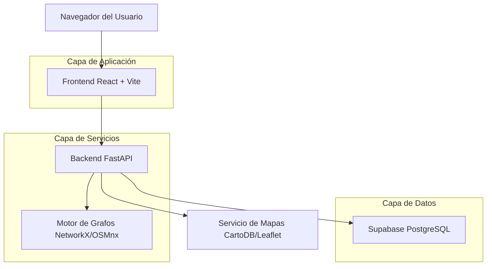
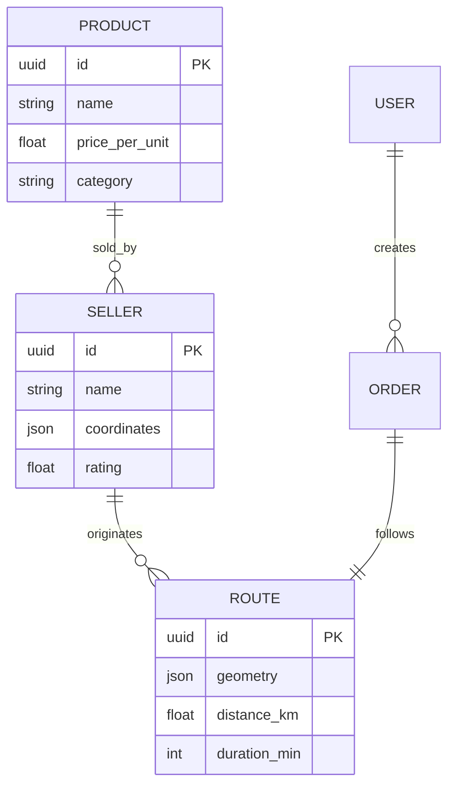

# 🏗️ Arquitectura Técnica - RutaOp

## 📄 Introducción

Este documento detalla la infraestructura tecnológica y el diseño de software de la plataforma RutaOp. El objetivo es proporcionar una visión clara de cómo interactúan los componentes del frontend, backend y la capa de datos para ofrecer un servicio de optimización logística de alta disponibilidad y rendimiento en la ciudad de Portoviejo.

***

## 🏗️ Diseño de la Arquitectura

La plataforma sigue un patrón de arquitectura **SPA (Single Page Application)** conectada a una **API REST** de alto rendimiento.



***

## 🛠️ Stack Tecnológico

* **Frontend**: React 18, TypeScript, Tailwind CSS, Vite, Leaflet.js.

* **Backend**: Python 3.9+, FastAPI, NetworkX, OSMnx, Uvicorn.

* **Base de Datos**: Supabase (PostgreSQL) para gestión de usuarios y trazabilidad.

* **Mapas**: Tiles de CartoDB (Dark Matter) y Google Maps (Satelital).

* **Comunicación**: Axios para peticiones HTTP y JWT para autenticación.

***

## 📡 Definición de APIs (Endpoints Clave)

### 1. Simulación de Rutas

`POST /api/routes/simulate`
Calcula las rutas óptimas desde múltiples distribuidores hacia la ubicación del usuario.

**Request:**

```json
{
  "user_lat": -0.9644,
  "user_lng": -80.3828,
  "product_id": "prod_123",
  "weight": 100
}
```

**Response:**

```json
{
  "recommended_route": { ... },
  "all_routes": [ ... ],
  "metrics": {
    "revenue": 1550.0,
    "profit": 310.0,
    "distance_total": 5.2,
    "duration_total": 12
  }
}
```

### 2. Puntos de Interés (POI)

`GET /api/points-of-interest`
Obtiene la lista de lugares destacados filtrados por ubicación o categoría.

***

## 🗄️ Modelo de Datos (Esquema)



***

## ⚙️ Estrategia de Despliegue y Escalabilidad

1. **Frontend**: Desplegado en **Vercel** o **Netlify** para aprovechar la red de distribución de contenido (CDN).
2. **Backend**: Contenerizado con **Docker** y desplegado en un servicio de nube (AWS App Runner o Render).
3. **Grafos**: Los archivos `.graphml` se cargan en memoria al iniciar el servidor para garantizar latencia mínima en los cálculos.
4. **Base de Datos**: Gestión gestionada por Supabase con backups automáticos y escalado vertical.

***

## 🔒 Consideraciones de Seguridad

* **CORS**: Configurado para permitir únicamente el dominio oficial del frontend.

* **Rate Limiting**: Implementado en el backend para prevenir abusos de la API de cálculo de rutas.

* **Encriptación**: Todo el tráfico viaja sobre HTTPS/TLS 1.3.

***

## 🔗 Recursos Adicionales

* [Documentación de FastAPI](https://fastapi.tiangolo.com/)

* [Referencia de React-Leaflet](https://react-leaflet.js.org/)

* [Guía de Modelado en Supabase](https://supabase.com/docs/guides/database)

