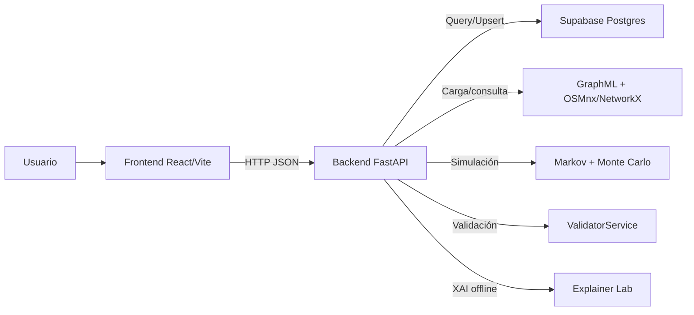

# TuDistri (RutaOp) — Documentación técnica exhaustiva

> Estado: desarrollo activo.
> Licencia: MIT.

Este documento es la fuente única de verdad del proyecto.
Integra arquitectura, fundamentos teóricos, especificación de API, modelo de datos, detalles de implementación (backend y frontend), simulación estocástica, métricas, validación y explicabilidad.

El sistema se orienta al caso Portoviejo (Ecuador) y a logística agroalimentaria urbana–periurbana.
La intención técnica es doble.
Primero, resolver ruteo realista sobre un grafo vial derivado de OpenStreetMap.
Segundo, elevar el ruteo determinista a una recomendación robusta bajo incertidumbre usando modelos estocásticos y KPIs interpretables.

---

## Tabla de contenidos

1. [Problema, alcance y criterios de diseño](#1-problema-alcance-y-criterios-de-diseño)
2. [Marco teórico y fundamentos matemáticos](#2-marco-teórico-y-fundamentos-matemáticos)
3. [Arquitectura general del sistema](#3-arquitectura-general-del-sistema)
4. [Modelo de datos y persistencia (Supabase/PostgreSQL)](#4-modelo-de-datos-y-persistencia-supabasepostgresql)
5. [Backend (FastAPI): estructura y funcionamiento](#5-backend-fastapi-estructura-y-funcionamiento)
6. [Motor de grafos: construcción del grafo, pesos y ruteo](#6-motor-de-grafos-construcción-del-grafo-pesos-y-ruteo)
7. [Simulación estocástica: Markov, Monte Carlo y triangular](#7-simulación-estocástica-markov-monte-carlo-y-triangular)
8. [Métricas y KPIs: definición, cálculo y trazabilidad](#8-métricas-y-kpis-definición-cálculo-y-trazabilidad)
9. [Validación técnica y estadística](#9-validación-técnica-y-estadística)
10. [Explicabilidad (XAI): laboratorio SHAP y modelo surrogate](#10-explicabilidad-xai-laboratorio-shap-y-modelo-surrogate)
11. [Frontend (React/Vite): estructura, lógica y UX](#11-frontend-reactvite-estructura-lógica-y-ux)
12. [API REST: endpoints, contratos y ejemplos](#12-api-rest-endpoints-contratos-y-ejemplos)
13. [Ejecución local, datos y despliegue](#13-ejecución-local-datos-y-despliegue)
14. [Análisis crítico, límites y comparación con otros enfoques](#14-análisis-crítico-límites-y-comparación-con-otros-enfoques)
15. [Conclusiones y trabajo futuro](#15-conclusiones-y-trabajo-futuro)

---

## 1. Problema, alcance y criterios de diseño

### 1.1 Problema operativo

La distribución agroalimentaria en entornos urbanos–periurbanos enfrenta restricciones simultáneas:
variabilidad de tiempos de viaje (tráfico, clima, cierres),
heterogeneidad de vías (arterias principales versus vías secundarias),
demanda distribuida (múltiples oferentes por producto),
costos compuestos (tiempo, combustible, merma de frescura) y
necesidad de trazabilidad operacional (eventos que justifican recálculo).

En este proyecto el “problema” se formaliza como:
para un usuario que selecciona un producto y un destino (punto en mapa),
proponer una ruta recomendada y rutas alternativas desde vendedores disponibles,
acompañadas de métricas que permitan comparar de forma comprensible.

### 1.2 Alcance funcional (lo que el sistema sí hace)

El sistema actualmente implementa:
carga y enriquecimiento de un grafo vial de Portoviejo desde OpenStreetMap,
cálculo de rutas sobre dicho grafo mediante Dijkstra y A*,
decodificación de la geometría de ruta usando geometrías de aristas (si existen),
simulación estocástica para transformar una duración base en una duración “robusta”,
KPIs derivados (puntualidad, frescura, satisfacción) y métricas administrativas,
recálculo dinámico con penalización por evento,
persistencia de eventos de simulación (cuando se provee `simulation_id`),
panel de validación en frontend que consulta métricas de validación en vivo,
laboratorio de explicabilidad que entrena un modelo surrogate y expone un dashboard.

### 1.3 Supuestos explícitos de modelado

La implementación asume lo siguiente:
el grafo se modela como MultiDiGraph dirigido (por sentido de calles),
el peso principal de ruteo es el tiempo de viaje (`weight`) en segundos,
la heurística de A* es admisible al dividir distancia Haversine por una velocidad máxima,
la incertidumbre ambiental se discretiza en cuatro estados (Normal/Tráfico/Lluvia/Huelga),
la variabilidad intrínseca se modela con distribuciones triangulares parametrizadas por estado,
los KPIs se calculan de forma determinista a partir de factores simulados (promedios Monte Carlo),
la persistencia en DB se usa como apoyo (productos, vendedores, POIs; y eventos),
no existe (aún) un flujo transaccional completo “pedido→entrega→KPIs finales” en producción.

### 1.4 Criterios de diseño y restricciones no funcionales

Los criterios implícitos en el código actual son:
latencia baja en cálculo (cargar el grafo una sola vez y mantenerlo en memoria),
respuestas explicables (no solo “ruta”, también “por qué conviene” vía KPIs),
robustez ante fallas parciales (si el grafo no carga, el sistema responde 503 en endpoints críticos),
operación local reproducible (scripts de seed y migraciones),
capacidad de validación comparativa A* versus Dijkstra,
capacidad de auditoría de eventos en recálculo (registro en `simulation_events`).

---

## 2. Marco teórico y fundamentos matemáticos

Esta sección no es decorativa.
Se conecta directamente con decisiones de implementación en el backend.

### 2.1 Teoría de grafos aplicada al transporte

Se define un grafo dirigido ponderado:

- Conjunto de nodos: \(V\), intersecciones o puntos de la red vial.
- Conjunto de aristas: \(E \subseteq V \times V\), segmentos viales dirigidos.
- Peso de arista: \(w: E \to \mathbb{R}_{\ge 0}\), costo de transitar la arista.

En el proyecto, el grafo proviene de OSMnx.
OSMnx exporta un grafo con atributos de geometría, longitud y velocidad estimada.
Luego se transforma el costo de ruteo a un “peso” de tiempo (segundos).

El problema base se formula como “camino de costo mínimo”:
dado un origen \(s\) y destino \(t\),
hallar un camino \(p = (v_0=s, v_1, ..., v_k=t)\)
que minimice la suma \(\sum_{i=0}^{k-1} w(v_i, v_{i+1})\).

### 2.2 Dijkstra: optimalidad, complejidad y rol en validación

El algoritmo de Dijkstra aplica cuando:
todos los pesos son no negativos.
Ese supuesto se mantiene en el proyecto:
si se detecta un peso negativo, se “clampa” a 0 en el backend.

Propiedad clave:
Dijkstra retorna el camino de costo mínimo exacto (óptimo global) bajo pesos no negativos.
En el proyecto, Dijkstra se usa como:
línea base (“ground truth”) para comparar A*,
y también como motor de recálculo cuando se penalizan eventos (ver Sección 6.5).

Complejidad típica con heap:
\(O((|V|+|E|)\log|V|)\).
En un grafo vial real, el costo práctico depende de:
densidad del grafo,
calidad de conectividad,
estructura de pesos y
ubicación relativa de \(s\) y \(t\).

### 2.3 A*: heurística, admisibilidad y consistencia

A* minimiza la exploración al usar:
una función \(f(n) = g(n) + h(n)\),
donde:

- \(g(n)\) es el costo real acumulado desde el origen hasta \(n\).
- \(h(n)\) es una estimación del costo restante desde \(n\) hasta el destino.

Si \(h\) es admisible (nunca sobreestima),
A* garantiza optimalidad.
En el proyecto, la heurística se define con distancia Haversine y una velocidad máxima.
Esto busca cumplir admisibilidad en “tiempo”:
si la velocidad máxima asumida es mayor o igual a la real alcanzable,
entonces el tiempo estimado por Haversine/velocidad es una cota inferior del tiempo real.

### 2.4 Distancia Haversine: base geométrica de la heurística

Sea \(R\) el radio terrestre.
Para dos coordenadas \((\phi_1,\lambda_1)\) y \((\phi_2,\lambda_2)\):

\[
a=\sin^2\left(\frac{\Delta\phi}{2}\right)
 + \cos(\phi_1)\cos(\phi_2)\sin^2\left(\frac{\Delta\lambda}{2}\right)
\]
\[
c = 2\cdot \arctan2(\sqrt{a}, \sqrt{1-a})
\]
\[
d = R\cdot c
\]

En el backend se implementa esta fórmula y se divide por una velocidad máxima (25 m/s).
La salida del heurístico se interpreta como segundos.
Esa unidad es coherente con el `weight` del grafo, también en segundos.

### 2.5 Incertidumbre: procesos estocásticos y justificación

El ruteo determinista entrega una ruta óptima dada una fotografía fija de pesos.
Pero en logística real el costo es variable.
Existen múltiples enfoques:
modelos predictivos de tráfico,
optimización robusta,
o simulación estocástica con distribución de escenarios.

Este proyecto adopta una aproximación explícita y controlable:

- Un proceso de Markov discreto para “estado del entorno”.
- Simulación Monte Carlo para propagar incertidumbre en tiempo/frescura/combustible.
- Distribución triangular como modelo parsimonioso cuando no hay series históricas densas.

El objetivo no es “predecir el futuro con precisión perfecta”.
El objetivo es:
producir métricas robustas y comparables bajo incertidumbre razonable.

### 2.6 Cadenas de Markov: definición y uso en el proyecto

Una cadena de Markov discreta se define por:
un conjunto finito de estados \(S\),
una matriz de transición \(P\),
y la propiedad de Markov:
\(\Pr(X_{t+1}=j \mid X_t=i, X_{t-1},...,X_0)=\Pr(X_{t+1}=j \mid X_t=i)\).

En el proyecto:
\(S = \{\text{Normal}, \text{Tráfico}, \text{Lluvia}, \text{Huelga}\}\).
La transición usa una “dominancia diagonal” (persistencia del estado).
Se simula un avance de estado por petición de ruta.

Interpretación:
no se modela cronología real minuto a minuto,
sino un mecanismo de variación entre solicitudes que reproduce “cambios de contexto”.

### 2.7 Monte Carlo: estimación, intervalos y estabilidad

Monte Carlo se usa para:
aproximar el valor esperado de variables aleatorias derivadas del entorno.
En el código se simulan múltiples iteraciones,
se acumulan resultados y
se promedian para obtener un “factor promedio” por solicitud.

En validación, se evalúa estabilidad mediante:
desviación estándar, intervalo de confianza del 95% y coeficiente de variación (CV).
El CV se define como:
\(\text{CV} = \frac{\sigma}{\mu}\cdot 100\%\).
Un CV menor sugiere estabilidad del estimador.

### 2.8 Distribución triangular: motivación y parametrización

La triangular es útil cuando se dispone de:
un mínimo plausible,
un máximo plausible,
y un valor más probable (moda),
pero no se cuenta con una distribución empírica robusta.

En el proyecto:
se parametrizan triángulos por estado para:
factor de tiempo,
tasa de degradación de frescura por minuto y
factor de consumo/combustible.

Esta parametrización permite “encender” y “apagar” severidad de eventos
sin reentrenar modelos.

---

## 3. Arquitectura general del sistema

### 3.1 Componentes y responsabilidades

El sistema sigue un patrón SPA + API REST.
La “inteligencia” de ruteo y simulación vive en backend.
El frontend orquesta interacción, visualización y narrativa de métricas.
Supabase cumple dos roles:
persistencia de catálogos (productos, vendedores, POIs) y
registro de eventos de simulación (cuando aplica).

Arquitectura a alto nivel:



### 3.2 Flujo de “Simular rutas” (ruta recomendada + alternativas)

1. El usuario elige un producto en la UI.
2. El usuario hace clic en el mapa para fijar destino (coordenadas).
3. El frontend llama a `POST /api/routes/simulate` con:
   `user_lat`, `user_lng`, `product_id` y `weight`.
4. El backend consulta Supabase:
   obtiene el producto y los vendedores que lo ofrecen.
5. Por cada vendedor:
   encuentra el nodo más cercano a usuario y a vendedor,
   ejecuta ruteo (Dijkstra en la implementación actual del endpoint),
   reconstruye la geometría,
   calcula distancia total,
   genera estado Markov,
   simula factores Monte Carlo,
   calcula KPIs,
   produce costos y métricas.
6. Ordena rutas por duración base y retorna:
   `recommended_route`, `all_routes` y un bloque `metrics` agregado.

### 3.3 Flujo de “Recálculo por evento”

Durante una simulación de entrega (frontend),
puede dispararse un evento (ej. lluvia o tráfico).
El frontend llama a `POST /api/routes/recalculate` con:
posición actual, destino, tipo de evento y progreso.
El backend penaliza aristas según evento y recalcula con Dijkstra.
Si el request incluye `simulation_id`, persiste un registro en `simulation_events`.

### 3.4 Carga del grafo y estrategia de rendimiento

En el startup de FastAPI:
se carga el grafo desde `data/processed/portoviejo_graph.graphml`.
Se mantiene en memoria global.
Esto reduce el costo de I/O y de parseo en cada request.

La estrategia prioriza:
baja latencia por request,
a costa de:
memoria y tiempo de arranque.

---

## 4. Modelo de datos y persistencia (Supabase/PostgreSQL)

La carpeta [supabase](file:///c:/Users/migue/OneDrive/Documents/rutaop/supabase) contiene migraciones SQL.
El backend usa Supabase como cliente en [main.py](file:///c:/Users/migue/OneDrive/Documents/rutaop/backend/api/main.py).

### 4.1 Tablas base

#### 4.1.1 `products`

Definida en [setup_schema.sql](file:///c:/Users/migue/OneDrive/Documents/rutaop/supabase/migrations/setup_schema.sql).
Campos relevantes (según migración y uso en backend):

- `id` (PK, varchar): identificador funcional (ej. `maiz`, `cacao`).
- `name` (varchar): nombre visible.
- `icon` (varchar): nombre de ícono (UI).
- `image_url` (text): URL o ruta estática (frontend sirve `/assets/...`).
- `price_per_unit` (float): precio por unidad.
- `unit` (varchar): unidad (ej. `qq`, `kg`, `saco`).
- `created_at` (timestamp).

Uso en backend:
`GET /api/products` lista el catálogo.
`POST /api/routes/simulate` consulta un producto por `id` para obtener `price_per_unit`, `unit`, `image_url`.

#### 4.1.2 `sellers`

Campos (migración):

- `id` (PK, varchar).
- `name` (varchar).
- `type` (varchar): Mercado/Mayorista/Productor/Minorista.
- `coordinates` (jsonb): `{lat, lng}`.
- `products` (text[]): lista de IDs de producto ofrecidos.
- `demand_factor` (float): factor de demanda/ingreso simulado.
- `rating` (float): calificación para UI.
- `trips_count` (int): “historial” usado por UI.
- `created_at` (timestamp).

Uso en backend:
`GET /api/sellers` y `GET /api/sellers?product_id=...`.
El filtro por producto usa el operador `cs` (contains) sobre arrays en Postgres.

#### 4.1.3 `pois`

Tabla de puntos de interés.
Se consulta desde `GET /api/pois` y puede filtrarse por `category`.

Uso típico:
mostrar POIs en mapa,
o enriquecer narrativas en UI (ej. “cerca de hospital/terminal”).

### 4.2 Tablas de trazabilidad de eventos

#### 4.2.1 `simulation_events`

Definida en [02_add_simulation_events.sql](file:///c:/Users/migue/OneDrive/Documents/rutaop/supabase/migrations/updates/02_add_simulation_events.sql).
Campos:

- `simulation_id` (uuid): identificador de sesión (debe venir del cliente u otro sistema).
- `event_type` (varchar): documentado como `rain`, `traffic`, `protest`.
- `trigger_location` (jsonb): `{lat, lng}`.
- `trigger_progress` (float): progreso 0..1.
- `impact_metrics` (jsonb): métricas de impacto (en el backend se guarda distancia y nueva duración).

En el backend actual, el insert ocurre en `POST /api/routes/recalculate`
cuando el request incluye `simulation_id`.

### 4.3 Tabla de pedidos (base para evolución)

La migración [01_add_orders_kpis.sql](file:///c:/Users/migue/OneDrive/Documents/rutaop/supabase/migrations/updates/01_add_orders_kpis.sql) crea `orders`.
Esta tabla está preparada para:
capturar costos y KPIs finales cuando el flujo “pedido real” se complete.

Actualmente:
la API de simulación calcula costos y KPIs,
pero no inserta pedidos en `orders` (la inserción está planteada como evolución).

### 4.4 Seguridad: Row Level Security (RLS)

Las migraciones habilitan RLS para algunas tablas.
Esto implica que:
si se activan políticas estrictas,
el cliente anónimo del frontend podría quedar sin acceso.

En desarrollo, se usa `SUPABASE_KEY` (service role) del lado del backend.
Eso permite al backend leer y escribir sin restricciones típicas de RLS.

---

## 5. Backend (FastAPI): estructura y funcionamiento

Código principal:
[backend/api/main.py](file:///c:/Users/migue/OneDrive/Documents/rutaop/backend/api/main.py).

### 5.1 Arranque (startup) y variables globales

En `startup_event` el servidor:
resuelve la ruta del proyecto,
crea un `DataLoader` apuntando al directorio `data` en la raíz del repositorio,
carga el grafo desde disco (o lo descarga si no existe),
crea `PathFinder` con el grafo,
crea `ValidatorService` para validación en vivo.

Si falla la carga:
se marca `graph=None` y `path_finder=None`,
permitiendo que el proceso arranque,
pero endpoints de ruteo responden 503.

Esto implementa un modo “degradado” observable en `/health`.

### 5.2 CORS y fronteras de integración

El backend permite orígenes:
`http://localhost:5173` y `http://localhost:3000`.

Para despliegues reales:
debe agregarse el origen del frontend desplegado,
o usar un proxy/rewrite (ver Vercel config en frontend).

### 5.3 Principio de contratos: Pydantic models

Los requests se modelan con Pydantic:

- `SimulationRequest`: `user_lat`, `user_lng`, `product_id`, `weight`.
- `RecalculateRequest`: `current_lat`, `current_lng`, `dest_lat`, `dest_lng`, `event_type`, `simulation_id?`, `progress?`.

Esto define el contrato mínimo esperado por el backend.
El frontend debe adherirse a esos nombres para evitar errores 422.

### 5.4 Pipeline de ruteo en `POST /api/routes/simulate`

La función `simulate_routes` implementa:

1. Verificar que el grafo esté disponible.
2. Consultar producto por `id` en Supabase.
3. Consultar vendedores cuyo array `products` contenga `product_id`.
4. Calcular el nodo más cercano al usuario con `osmnx.distance.nearest_nodes`.
5. Para cada vendedor:
   - Calcular nodo del vendedor.
   - Ejecutar ruteo (Dijkstra).
   - Reconstruir geometría de ruta usando atributos `geometry` de arista cuando existan.
   - Sumar longitudes de aristas para distancia total.
   - Calcular estado Markov y simular factores.
   - Calcular KPIs y métricas de negocio.
6. Ordenar rutas por `duration_seconds` ascendente.
7. Agregar métricas administrativas y retornar.

Observación importante de coherencia:
el endpoint usa Dijkstra para producir rutas.
A* está implementado y se valida,
pero no se usa en producción dentro de `simulate_routes` en el estado actual del código.
Esta decisión puede ser deliberada (priorizar exactitud) o temporal (migración).
La validación comparativa permite justificar un eventual cambio a A*.

### 5.5 Recálculo en `POST /api/routes/recalculate`

El recálculo aplica penalización por `event_type` durante Dijkstra.
La penalización ocurre dentro de `PathFinder.run_dijkstra`.

Eventos soportados por el código:
`rain`, `traffic`, `protest`.

La semántica es:

- `rain`: penaliza vías secundarias y no pavimentadas.
- `traffic`: penaliza arterias principales (congestión).
- `protest`: penaliza fuerte arterias tipo trunk/primary (simula bloqueo/evitación).

El endpoint además calcula:
distancia total de la ruta recalculada y duración.
Si se provee `simulation_id`, inserta un evento en `simulation_events`.

### 5.6 Manejo de errores y códigos HTTP

Patrones en el backend:

- 503 si el grafo o el servicio requerido no está listo.
- 400 si no se puede mapear coordenadas a nodos del grafo (nearest_nodes falla).
- 404 si no se encuentra ruta (grafo desconectado o sin camino dirigido).
- 500 en fallos inesperados durante validación.

Estos códigos son importantes para el frontend:
permiten diferenciar “mover el punto” (400/404) de “backend degradado” (503).

### 5.7 Dependencias Python (geoespacial y XAI)

Las dependencias se listan en [backend/requirements.txt](file:///c:/Users/migue/OneDrive/Documents/rutaop/backend/requirements.txt).
Incluyen:
OSMnx, NetworkX, GeoPandas, SciPy,
FastAPI/Uvicorn,
Supabase,
y librerías de XAI (SHAP, ExplainerDashboard).

Para despliegue en contenedor:
el [Dockerfile](file:///c:/Users/migue/OneDrive/Documents/rutaop/backend/Dockerfile) instala librerías del sistema necesarias para geoespacial.

---

## 6. Motor de grafos: construcción del grafo, pesos y ruteo

Código clave:
[data_loader.py](file:///c:/Users/migue/OneDrive/Documents/rutaop/backend/data_loader.py) y
[algorithms.py](file:///c:/Users/migue/OneDrive/Documents/rutaop/backend/algorithms.py).

### 6.1 Generación y persistencia del grafo (GraphML)

El grafo se persiste en:
`data/processed/portoviejo_graph.graphml` en la raíz del repositorio.

`DataLoader.load_graph` implementa:

- Si el archivo existe y no se fuerza descarga: cargar desde disco.
- Si no existe: descargar desde OpenStreetMap usando `graph_from_point`.

Se usa un punto central aproximado y un radio (`dist`) de 12km.
Ese valor se elige para cubrir ciudad y periferia y reducir “fallos de grafo pequeño”.

### 6.2 Enriquecimiento del grafo: velocidades, tiempos y peso

Tras descargar:
se ejecuta `_enrich_graph`.

Enriquecimiento:

- `ox.add_edge_speeds` infiere velocidad por tipo de vía.
- `ox.add_edge_travel_times` calcula `travel_time = length / speed`.
- Se define `weight` como `travel_time` (float) o 1.0 si falta.

Interpretación:
el algoritmo de ruteo optimiza tiempo, no distancia.
La distancia se calcula aparte con `length` para métricas.

### 6.3 Decodificación geométrica de rutas

Los algoritmos retornan una lista de nodos.
La API necesita devolver una polilínea (lat/lng) para dibujar en Leaflet.

La decodificación itera arista por arista:

- Si la arista tiene atributo `geometry` (LineString):
  se extraen coordenadas y se convierten de (lng,lat) a [lat,lng].
- Si no tiene geometría:
  se usa fallback a coordenadas de nodos (`y` lat, `x` lng).

Esto evita polilíneas “rectas” irreales cuando la geometría existe.

### 6.4 Implementación de Dijkstra en `PathFinder.run_dijkstra`

Características relevantes de implementación:

- Usa heap (`heapq`) como cola de prioridad.
- Mantiene `min_dist` para costos mínimos hallados.
- Mantiene `parents` para reconstrucción de camino.
- Lleva conteo de nodos explorados y tiempo total.
- Protege contra:
  nodos inexistentes y pesos negativos.

El retorno incluye:
`path`, `cost`, `explored_nodes`, `time_seconds`.

### 6.5 Penalización por eventos (ruteo reactivo)

La penalización es un mecanismo simple pero funcional:
se aplica un multiplicador `penalty` al peso base de una arista.
El multiplicador depende del tipo de vía (`highway`) y del evento.

Formalmente:
si el peso base es \(w_e\) y el multiplicador por evento es \(\alpha_e\),
el peso modificado es \(w'_e = \alpha_e \cdot w_e\).

Efecto:
las aristas con alta penalización se vuelven poco atractivas.
No se eliminan del grafo, pero se “evitan” por costo.

Ventajas:
no requiere reentrenar modelos,
es explicable (se puede describir qué vías se penalizan),
es robusto ante falta de datos en tiempo real.

Limitaciones:
no captura congestión localizada con precisión,
no modela cierres totales salvo por penalización extrema,
y puede introducir rutas largas si el grafo alternativo es escaso.

### 6.6 Implementación de A* en `PathFinder.run_astar`

La implementación usa una cola con tuplas `(f_score, cost, node)`.
El heurístico se calcula con:
`haversine_heuristic(v, target, G)`.

El heurístico retorna segundos estimados bajo velocidad máxima.
Esto mantiene la coherencia dimensional con `weight`.

El retorno también incluye:
`explored_nodes` y `time_seconds`,
lo cual permite comparar costo de cómputo contra Dijkstra en validación.

### 6.7 Correctitud práctica: grafos dirigidos y caminos inexistentes

OSMnx crea grafos dirigidos.
Por tanto:
un camino puede existir de A→B y no de B→A,
dependiendo de sentidos de vía.

La API maneja “no hay ruta” retornando 404 en recálculo,
y omitiendo vendedores sin camino en simulación.

Para UX:
esto se percibe como “mueva un poco el punto”.
Técnicamente:
es una propiedad del grafo dirigido y de su conectividad local.

---

## 7. Simulación estocástica: Markov, Monte Carlo y triangular

Código:
[simulation_engine.py](file:///c:/Users/migue/OneDrive/Documents/rutaop/backend/simulation_engine.py).

### 7.1 Estados de simulación (`SimulationState`)

Estados discretos:

- Normal.
- Tráfico.
- Lluvia.
- Huelga.

Estos estados no son “eventos únicos”.
Representan un contexto operativo con distribuciones distintas.

### 7.2 Cadena de Markov (`MarkovChain`)

La matriz de transición está definida explícitamente en código.
Presenta dominancia diagonal:
la probabilidad de permanecer en el mismo estado es alta.

Esto implementa “persistencia”:
una vez en lluvia, es razonable que la lluvia continúe con probabilidad alta.

En el endpoint de simulación:
se llama `next_state()` una vez por petición.
Eso acopla “estado global del sistema” a la frecuencia de consultas.
En una evolución futura:
podría evolucionarse el estado por tiempo real y no por request.

### 7.3 Calibración de tiempo base (`FactorSimulator.calibrate_base_time`)

Antes de simular factores,
el sistema calibra el tiempo base con una función por tramos.

Motivación:
el tiempo derivado del grafo puede ser demasiado optimista
si los atributos de velocidad son estimados o incompletos.

La calibración define rangos:

- Distancias cortas (<2.5km): 3–6 minutos.
- Distancias medias (2.5–9km): 10–18 minutos.
- Distancias mayores (>=9km): 19–30+ con pendiente lineal.

La salida final es:
`max(raw_duration_min, calibrated)`.

Interpretación:
si el grafo ya sugiere un tiempo mayor (peor caso realista), se respeta.
si el grafo es demasiado optimista, se corrige hacia arriba.

### 7.4 Simulación de factores (`FactorSimulator.simulate_factors`)

La simulación genera, por iteración:

- `time_factor`: multiplicador del tiempo base.
- `initial_freshness`: frescura inicial en porcentaje.
- `degradation_rate`: pérdida porcentual por minuto.
- `fuel_factor`: multiplicador de consumo/combustible.

La distribución para cada variable es triangular con parámetros por estado.

Ejemplos (lectura del código):

- Normal: tiempo \((0.95, 1.0, 1.05)\), combustible \((0.9, 1.0, 1.1)\).
- Tráfico: tiempo \((1.2, 1.4, 1.8)\), combustible \((1.3, 1.5, 1.8)\).
- Lluvia: tiempo \((1.1, 1.25, 1.4)\), degradación mayor.
- Huelga: tiempo \((1.5, 2.0, 3.0)\).

El método retorna promedios Monte Carlo:
no retorna una distribución completa,
sino un vector de factores promedio y el estado.

### 7.5 KPIs de cliente (`KPICalculator.calculate_kpis`)

El cálculo de KPIs toma:
factores simulados (promedios) y métricas base (duración estimada).

Se calculan:

**Puntualidad**.
Se define una fiabilidad:
\(1 - \frac{\max(0, T_{sim} - T_{est})}{T_{est}}\).
Luego se escala a 0–100.

**Frescura**.
Se define:
\(\text{degradación total} = \text{degradation\_rate}\cdot T_{sim}\).
Frescura final:
\(\max(0, \text{freshness\_init} - \text{degradación total})\).

**Satisfacción**.
Se parte de un valor triangular en 1–5
y se aplican penalizaciones si puntualidad o frescura caen bajo 90.

La satisfacción se trunca a [1.0, 5.0].

### 7.6 KPIs administrativos (`AdminKPICalculator.calculate_admin_metrics`)

Este bloque genera métricas para dashboard administrativo.
En el estado actual del código:

- `platform_profit` se calcula como 15% del `estimated_revenue` agregado.
- `prediction_accuracy`, `avg_time_reduction`, `revenue_growth` son valores fijos.

Esto es importante para documentación técnica:
esas métricas existen y se exponen,
pero aún no se derivan de datos reales o históricos.
Su presencia es útil para UI,
pero deben interpretarse como placeholders.

---

## 8. Métricas y KPIs: definición, cálculo y trazabilidad

El proyecto maneja tres capas de métricas:

1. Métricas geométricas (distancia, geometría de ruta).
2. Métricas operativas (tiempos base y simulados).
3. Métricas de negocio y experiencia (costos, ingresos, KPIs de cliente).

### 8.1 Distancia y duración

La distancia total se calcula sumando `length` (metros) de cada arista.
La duración base proviene del costo de ruteo `cost` (segundos).

La duración simulada se deriva de:
calibración por distancia + factor triangular por estado.

La distinción base/simulada es esencial:
la base representa “lo que el grafo sugiere”,
la simulada representa “lo que se espera bajo incertidumbre”.

### 8.2 Costos e ingresos

En `simulate_routes` se calculan:

- `transport_cost = 2.50 + (dist_km * 0.35 * fuel_factor)`.
- `simulated_price = product.price_per_unit * 0.20` (ajuste para UI).
- `estimated_revenue = (simulated_price * 100) * demand_factor`.
- `net_profit = estimated_revenue - transport_cost`.

Estos cálculos son simplificados.
Su rol es:
demostrar cómo integrar factores físicos (distancia/combustible)
en métricas económicas para comparación.

### 8.3 KPIs de cliente: lectura operacional

Los KPIs 0–100 (puntualidad/frescura) se interpretan como:
probabilidad o calidad relativa bajo el estado actual.
No son garantías contractuales.
Son un indicador de “riesgo” asociado al contexto.

La satisfacción 1–5 es una proyección sintetizada:
recoge puntualidad y frescura bajo una función de penalización.

### 8.4 Trazabilidad de eventos

Cuando se recalcula por evento y se provee `simulation_id`,
se registra un evento en `simulation_events`.

Esto permite:
auditar qué ocurrió,
dónde ocurrió,
en qué fase (progreso),
y qué impacto tuvo (nueva duración, distancia).

En evoluciones futuras:
este registro puede conectarse a:
tablas de pedidos (`orders`) y
dashboards de calidad de servicio.

---

## 9. Validación técnica y estadística

La validación se implementa en:
[validator_service.py](file:///c:/Users/migue/OneDrive/Documents/rutaop/backend/validation/validator_service.py).

### 9.1 Validación de algoritmos de ruteo

La función `validate_routing_algorithms(samples=N)`:

- Selecciona pares aleatorios de nodos.
- Ejecuta Dijkstra y A* para cada par.
- Compara costos absolutos (tolerancia 1e-6).
- Acumula tiempos de ejecución.

Métricas:

- `matches`: conteo de coincidencias exactas de costo.
- `cost_discrepancy_avg`: discrepancia promedio.
- `speedup_factor`: razón de tiempos promedio (Dijkstra/A*).

Interpretación:
si discrepancia es ~0 y speedup > 1,
es evidencia técnica de que A* puede reemplazar Dijkstra en producción
con igual optimalidad y menor costo de cómputo.

### 9.2 Validación de estabilidad de simulación

`validate_simulation_stability(n_simulations=N)`:

- Repite simulaciones en un escenario fijo.
- Mide duración simulada y puntualidad.
- Calcula:
  media, desviación estándar, IC 95% y CV.

El IC 95% se calcula como:
\(\mu \pm 1.96\cdot \frac{\sigma}{\sqrt{N}}\).

Uso en frontend:
el panel de validación muestra el CV como “estabilidad”.

### 9.3 Pruebas unitarias del backend

Hay pruebas en:
[backend/tests](file:///c:/Users/migue/OneDrive/Documents/rutaop/backend/tests).

Se usan grafos sintéticos pequeños para:
probar caminos de Dijkstra y A*,
probar heurística Haversine en rangos razonables,
probar calibración y KPIs en simulación.

Las pruebas están escritas con `unittest`.

---

## 10. Explicabilidad (XAI): laboratorio SHAP y modelo surrogate

Este módulo existe para responder una pregunta técnica:
si el sistema produce KPIs y decisiones bajo incertidumbre,
¿podemos explicar qué variables dominan el resultado?

### 10.1 Generación de dataset sintético (“gemelo de datos”)

[data_harvester.py](file:///c:/Users/migue/OneDrive/Documents/rutaop/backend/validation/data_harvester.py) genera datos con la lógica real.
Esto es crucial:
no se generan datos aleatorios sin relación,
sino ejecuciones reales del motor de simulación.

Features:

- `distance_km`, `base_duration_min`.
- indicadores binarios de estado: `is_raining`, `is_traffic`, `is_strike`.

Targets:

- `final_satisfaction`, `final_punctuality`, `final_freshness`, `final_duration`.

Resultado:
un dataset con miles de filas que aproxima el comportamiento del sistema.

### 10.2 Modelo surrogate y dashboard

[explainer_lab.py](file:///c:/Users/migue/OneDrive/Documents/rutaop/backend/validation/explainer_lab.py) entrena un `RandomForestRegressor`.
El objetivo explícito del surrogate es:
aproximar `final_satisfaction` como función de variables observables.

Luego construye un `ExplainerDashboard` con SHAP.
Este dashboard permite:
ver importancias globales,
analizar casos individuales,
y usar “what-if” para explorar sensibilidad.

### 10.3 Lectura correcta de la explicabilidad

El dashboard explica el surrogate.
Y el surrogate aproxima el motor real.
Por tanto, la explicabilidad es de segundo orden:
es una explicación aproximada del comportamiento del sistema, no una prueba formal.

Sin embargo, su valor es alto para:
diagnóstico de parametrización,
comunicación con stakeholders,
y validación de consistencia (ej. lluvia debería afectar negativamente satisfacción).

---

## 11. Frontend (React/Vite): estructura, lógica y UX

El frontend está en [frontend](file:///c:/Users/migue/OneDrive/Documents/rutaop/frontend).
Stack: React 18, TypeScript, Tailwind, React-Leaflet, Recharts, Axios.

### 11.1 Entradas del usuario y rutas UI

La UI principal se implementa en `Home`.
El panel de validación está en `Validation`.
El enrutamiento vive en [App.tsx](file:///c:/Users/migue/OneDrive/Documents/rutaop/frontend/src/App.tsx).

### 11.2 Cliente HTTP y configuración por entorno

La capa de API está en [services/api.ts](file:///c:/Users/migue/OneDrive/Documents/rutaop/frontend/src/services/api.ts).
`API_URL` se resuelve como:
`VITE_API_URL` o fallback `http://127.0.0.1:8000/api`.

Esto obliga a:
alinear `.env` del frontend con el backend.

### 11.3 Tipos: contrato esperado en TypeScript

Los tipos de rutas están en [types.ts](file:///c:/Users/migue/OneDrive/Documents/rutaop/frontend/src/types.ts).

Nota de coherencia:
el backend retorna `recommended_route` y `all_routes`.
El archivo `services/api.ts` define `SimulationResponse` con esos campos.
Sin embargo, el `types.ts` también define otra interfaz `SimulationResponse` distinta (`routes`).

Esto no afecta la documentación académica del sistema,
pero sí debe considerarse como “deuda técnica de tipado”:
dos definiciones con el mismo nombre pueden inducir confusión si se reexportan.

### 11.4 Mapa y visualización geoespacial

El mapa se implementa en [DarkMap.tsx](file:///c:/Users/migue/OneDrive/Documents/rutaop/frontend/src/components/DarkMap.tsx).
Responsabilidades típicas:

- renderizar tiles,
- dibujar polilíneas de rutas,
- ubicar marcadores (usuario, vendedores, POIs),
- animar vehículo durante simulación (progreso 0..1).

### 11.5 Panel de métricas

[MetricsDashboard.tsx](file:///c:/Users/migue/OneDrive/Documents/rutaop/frontend/src/components/MetricsDashboard.tsx) consume métricas de la ruta seleccionada.
Muestra:
costos, ingresos, beneficio neto,
y KPIs de satisfacción/puntualidad/frescura.

### 11.6 Panel de validación y explicabilidad

[Validation.tsx](file:///c:/Users/migue/OneDrive/Documents/rutaop/frontend/src/pages/Validation.tsx) integra:

- consulta a `GET /api/validation/stats`,
- render de charts (pie/bar),
- tabla de “mejoras” con selección de item,
- exportación CSV.

Este panel está diseñado como una vista “técnica”:
conecta decisiones algorítmicas (A* vs Dijkstra) con métricas observables.

---

## 12. API REST: endpoints, contratos y ejemplos

La API corre por defecto en `http://localhost:8000`.
Rutas bajo prefijo `/api`.
Swagger disponible en `/docs`.

### 12.1 Health

#### `GET /health`

Retorna estado del grafo y del cliente Supabase.

Ejemplo:

```json
{
  "status": "ok",
  "graph_loaded": true,
  "supabase_connected": true
}
```

### 12.2 Catálogos

#### `GET /api/products`

Retorna lista de productos (tabla `products`).

#### `GET /api/sellers`

Retorna lista de vendedores (tabla `sellers`).

#### `GET /api/sellers?product_id={id}`

Filtra vendedores que ofrecen el producto (array contains).

#### `GET /api/pois`

Retorna POIs.

#### `GET /api/pois?category={cat}`

Filtra por categoría.

### 12.3 Simulación de rutas

#### `POST /api/routes/simulate`

Body (modelo real del backend):

```json
{
  "user_lat": -1.054,
  "user_lng": -80.453,
  "product_id": "cacao",
  "weight": 50.0
}
```

Respuesta (estructura real):

```json
{
  "recommended_route": {
    "seller_id": "mercado_1",
    "seller_name": "Mercado Central",
    "route_geometry": [[-1.05, -80.45]],
    "duration_seconds": 900.0,
    "distance_meters": 3500.0,
    "distance_km": 3.5,
    "duration_min_base": 15.0,
    "duration_min": 17.2,
    "transport_cost": 3.74,
    "estimated_revenue": 1200.0,
    "net_profit": 1196.26,
    "load_percentage": 100,
    "product_image": "/assets/products/cacao.jpg",
    "product_name": "Cacao",
    "price_per_unit": 24.0,
    "freshness_score": 96.5,
    "punctuality_score": 92.1,
    "satisfaction_score": 4.6,
    "simulation_state": "Tráfico"
  },
  "all_routes": [],
  "metrics": {
    "revenue": 0.0,
    "profit": 0.0,
    "distance_total": 3.5,
    "duration_total": 17.2,
    "product_cost": 0.0,
    "logistic_cost": 0.0,
    "total_client_cost": 0.0,
    "platform_profit": 180.0,
    "prediction_accuracy": 95.0,
    "avg_time_reduction": 18.5,
    "revenue_growth": 12.4
  }
}
```

Notas:

- `route_geometry` se retorna en formato `[lat, lng]`.
- `duration_seconds` y `duration_min_base` conviven:
  el primero es costo del ruteo,
  el segundo es una versión en minutos redondeada.
- El bloque `metrics` agregado contiene campos fijos/placeholder en admin.

### 12.4 Recálculo por evento

#### `POST /api/routes/recalculate`

Body:

```json
{
  "current_lat": -1.054,
  "current_lng": -80.453,
  "dest_lat": -1.045,
  "dest_lng": -80.456,
  "event_type": "rain",
  "simulation_id": "b2d6f7c1-3b70-4f6e-9f24-1e2d40fbdfb0",
  "progress": 0.42
}
```

Respuesta:

```json
{
  "route_geometry": [[-1.05, -80.45]],
  "distance_km": 4.12,
  "duration_min": 19.8,
  "event_applied": "rain"
}
```

Notas:

- `event_type` soporta `rain`, `traffic`, `protest`.
- Si `simulation_id` es omitido, no se persiste evento.

### 12.5 Validación en vivo

#### `GET /api/validation/stats`

Respuesta:

```json
{
  "routing": {
    "samples": 15,
    "matches": 15,
    "dijkstra_avg_time_ms": 18.2,
    "astar_avg_time_ms": 3.1,
    "speedup_factor": 5.87,
    "cost_discrepancy_avg": 0.0
  },
  "simulation": {
    "n_simulations": 100,
    "mean_duration": 15.03,
    "std_dev": 0.22,
    "ci_95_lower": 14.99,
    "ci_95_upper": 15.07,
    "cv_percent": 1.46,
    "mean_punctuality": 99.2
  },
  "timestamp": 1730000000.0
}
```

---

## 13. Ejecución local, datos y despliegue

### 13.1 Requisitos

- Python 3.9 (recomendado por dependencias geoespaciales).
- Node.js 18+.
- Variables de entorno Supabase (para backend y scripts).

### 13.2 Variables de entorno

Backend (en `.env` en raíz o `backend/.env`):

```env
SUPABASE_URL=...
SUPABASE_KEY=...
```

Frontend (en `frontend/.env`):

```env
VITE_API_URL=http://127.0.0.1:8000/api
```

### 13.3 Instalación backend

```bash
python -m venv .venv
.\.venv\Scripts\activate
pip install -r backend/requirements.txt
```

### 13.4 Instalación frontend

```bash
cd frontend
npm install
```

### 13.5 Ejecución en desarrollo

Backend:

```bash
cd backend
python -m uvicorn api.main:app --reload --host 0.0.0.0 --port 8000
```

Frontend:

```bash
cd frontend
npm run dev
```

### 13.6 Datos: grafo y seed de catálogos

Grafo:
si `data/processed/portoviejo_graph.graphml` no existe,
`DataLoader` lo descargará en el arranque.

Catálogos:
puedes poblar productos y vendedores con:

```bash
python backend/scripts/update_data.py
```

Este script hace upsert en `products` y `sellers`.
Las imágenes se referencian como rutas estáticas `/assets/products/*.jpg`,
que existen en [frontend/public/assets/products](file:///c:/Users/migue/OneDrive/Documents/rutaop/frontend/public/assets/products).

### 13.7 Laboratorio de validación y explicabilidad

El laboratorio corre un dashboard en puerto 8050.

```bash
python run_validation_lab.py
```

Internamente ejecuta [explainer_lab.py](file:///c:/Users/migue/OneDrive/Documents/rutaop/backend/validation/explainer_lab.py).

### 13.8 Despliegue (frontend)

El frontend incluye configuración de Vercel en:
[frontend/vercel.json](file:///c:/Users/migue/OneDrive/Documents/rutaop/frontend/vercel.json).

Incluye rewrites:

- `/api/*` → backend desplegado (ej. Render).
- `/*` → `index.html` para SPA.

### 13.9 Despliegue (backend)

El backend cuenta con Dockerfile.
En entornos como Render se puede:
construir imagen y exponer puerto 8000.

---

## 14. Análisis crítico, límites y comparación con otros enfoques

### 14.1 Ruteo exacto vs ruteo informado por heurística

Dijkstra garantiza optimalidad y es simple de validar.
A* puede mantener optimalidad si la heurística es admisible
y normalmente explora menos.

En este proyecto:
la validación cuantifica speedup y coherencia.
Esto crea una base técnica para decidir A* en producción.

### 14.2 Penalización de eventos vs datos de tráfico en tiempo real

La penalización por `highway` es una aproximación estructural.
Comparada con integrar APIs de tráfico real:

Ventajas:
control, explicabilidad, costo cero en datos externos, resiliencia offline.

Desventajas:
no captura congestión puntual ni incidentes reales,
y depende de la calidad de etiquetado OSM.

### 14.3 Simulación triangular vs modelos estadísticos entrenados

La triangular es un modelo de incertidumbre “de primer orden”.
Si existieran series históricas densas:
se podría usar aprendizaje supervisado para predecir distribuciones.

Sin embargo:
la triangular facilita calibración manual por expertos
y es adecuada cuando la incertidumbre principal es “ordinal” (Normal/Tráfico/Lluvia/Huelga).

### 14.4 Estado global Markov: implicación operacional

El estado Markov es global en el backend.
Esto significa que:
dos usuarios simultáneos comparten el mismo “estado del sistema”.

Como modelo conceptual es aceptable,
pero a nivel de producción real se debería:
separar estado por región, hora o sesión,
o estimar estado desde señales externas.

### 14.5 Explicabilidad surrogate: utilidad y límites

El dashboard SHAP aporta:
capacidad de analizar sensibilidad y consistencia.

Límites:
no explica directamente el algoritmo simbólico,
sino un modelo entrenado sobre outputs del motor.

Esto es apropiado para:
auditar “tendencias” y “drivers”,
pero no para probar correctitud formal.

---

## 15. Conclusiones y trabajo futuro

### 15.1 Conclusiones técnicas

El proyecto integra coherentemente:

- Ruteo sobre grafo vial real (OSMnx/NetworkX).
- Simulación estocástica controlable (Markov + triangular + Monte Carlo).
- KPIs que conectan física (tiempo/distancia) con experiencia (frescura/satisfacción).
- Validación cuantitativa de algoritmos (A* versus Dijkstra) con métricas medibles.
- Trazabilidad de eventos de recálculo en base de datos.
- Un módulo de explicabilidad para entender sensibilidad del sistema.

### 15.2 Líneas de evolución (priorizadas por impacto)

1. Usar A* en `POST /api/routes/simulate` con validación continua.
2. Persistir pedidos en `orders` y cerrar el ciclo “simulación→entrega→KPIs finales”.
3. Definir `simulation_id` desde backend (UUID generado) para trazabilidad end-to-end.
4. Sustituir placeholders de admin por métricas reales (histórico en DB).
5. Introducir optimización multi-objetivo (tiempo vs costo vs frescura) y/o VRP para flotas.
